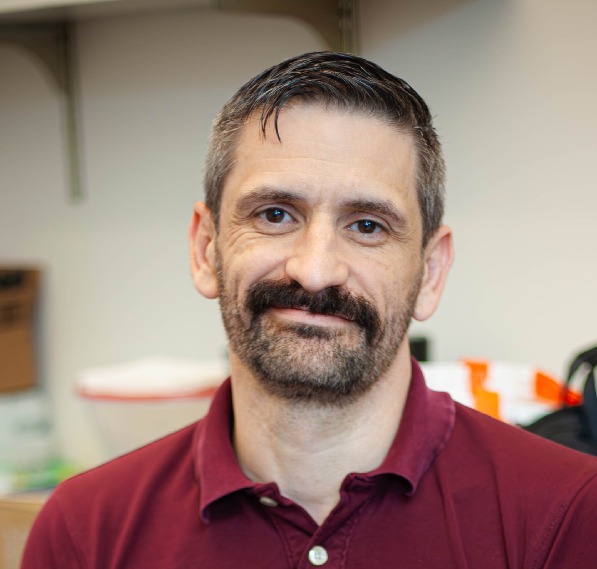

## Hi there 👋

I am a professor at North Seattle College for the Bachelor of Science in Computer Science program. I have been in this role since Fall of 2022 and I have the best job in the world because I get to work with the most amazing students! I love developing curriculum for students to help them learn and finding new ways to help lift up those who have not have the privelages others have had so they can change their lives!

- 🔭 I’m currently working on developing out the data science track curriculum and improving on the software development track's content, endlessly!
- 🌱 I’m currently learning cybersecurity, machine learning, AI, prompt engineering, and how to be the best at the coolest video games!
- 👯 I’m looking to collaborate on cybersecurity & machine learning research as well as computer science education development.
- 🤔 I’m looking for help with ways to education computer science students in a way that makes them as employable as possible.
- 💬 Ask me about how you can learn or help students develop their skills and become a force for good in tech!
- 📫 How to reach me: eric.lloyd@seattlecolleges. Linked-In: https://www.linkedin.com/in/eric-lloyd-b1aa8722/
- 😄 Pronouns: He/him
- ⚡ Fun fact: I cannot live without the love of doggos!

